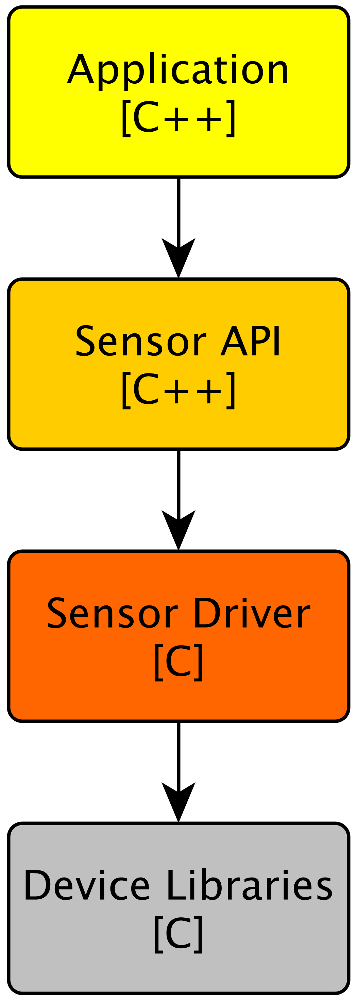

# STM32 Single Sensor Projects #

>This repository contains seperate sensor studies I have done using only the datasheets of the common sensors.  
Feel free use the code I have created for your project. One rule though, just do not remove any header I have put over my driver and API files.  

## Available Projects
- ADXL345 accelerometer **(development in progress)**  

## Upcoming Projects
- BME680 gas sensor
- DS1302 real time clock
- MCP9808 temperature sensor
- SHT30 temperature sensor

 
Here is the simplified SW architecture followed when creating the projects in this repository:  

    

 

Have a great time snooping through this repo! 
